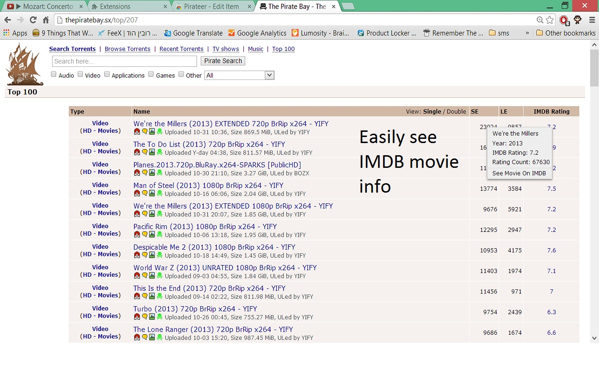

# Pirateer for Chrome

> Pirateer is a Chrome Extension that adds IMDb ratings to TV shows and movies on The Pirate Bay

Search for movies and TV Shows in The Pirate Bay and automatically see their IMDB ratings.

#### 

*This extension is in no way affiliated with either The Pirate Bay or IMDB and provides the information as is.*

## Install

Install from the [Chrome Webstore](https://chrome.google.com/webstore/detail/pirateer/dleipnbkaniagkflpbhloiadkdooaacd).

## Development Install

1. Git clone this repository.
2. Run `npm install && bower install`.
3. Run `grunt build` to build a running version into `build/`.
4. Load the `build/` as an unpacked extension in `chrome://extensions`.
5. Use extension.

## License

Pirateer is licensed under the [BSD 3-Clause license](http://opensource.org/licenses/BSD-3-Clause)
© 2014 by [Gilad Peleg](https://github.com/pgilad)
